# Práctica Crear imagen personalizada

## 1. Título

**Creación de Imagen Docker Personalizada para Aplicación React con Backend Simulado**

---

## 2. Tiempo de duración

**Tiempo estimado:** 120 minutos

---

## 3. Fundamentos

Para desarrollar esta práctica es fundamental comprender conceptos relacionados con la contenerización, imágenes Docker y despliegue de aplicaciones web modernas. Docker es una plataforma que permite empacar aplicaciones junto con sus dependencias dentro de contenedores ligeros, asegurando que funcionen de forma idéntica en cualquier entorno, ya sea desarrollo, pruebas o producción.

Una **imagen Docker** es una plantilla inmutable que contiene todo lo necesario para ejecutar una aplicación, como el código fuente, dependencias, librerías y configuraciones del sistema operativo. Las imágenes se pueden construir usando archivos llamados **Dockerfile**, que son scripts de texto donde se especifican instrucciones secuenciales: la imagen base del sistema operativo, pasos de instalación de dependencias, comandos de compilación y configuración final del contenedor.

**Docker** utiliza una arquitectura cliente-servidor. El cliente de Docker se comunica con el daemon de Docker, que es el responsable de construir, ejecutar y distribuir los contenedores. Un contenedor es una instancia en ejecución de una imagen Docker, aislado del sistema host pero compartiendo el mismo kernel del sistema operativo, lo que lo hace extremadamente liviano comparado con las máquinas virtuales tradicionales.

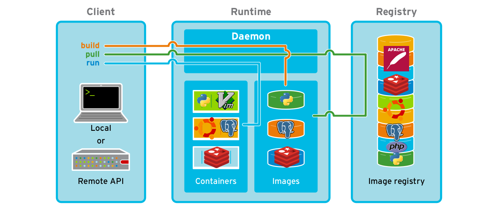

**Figura 3-1. Arquitectura de Docker mostrando la relación entre cliente, daemon y registry.**

En esta práctica, el objetivo es generar una imagen personalizada a partir de un proyecto desarrollado en **React**, un framework de JavaScript creado por Facebook que permite crear interfaces de usuario dinámicas basadas en componentes reutilizables. React utiliza un DOM virtual para optimizar las actualizaciones de la interfaz y proporciona una experiencia de usuario fluida en aplicaciones web de una sola página (SPA).

React, cuando se construye para producción mediante el comando `npm run build`, genera archivos estáticos optimizados (HTML, CSS, JavaScript) que deben ser servidos mediante un servidor web. Para producción, uno de los servidores más utilizados es **Nginx**, un servidor web de código abierto reconocido por su alto rendimiento, estabilidad, bajo consumo de recursos y capacidad para manejar un gran número de conexiones simultáneas. Nginx puede actuar como servidor web, proxy inverso, balanceador de carga y caché HTTP.

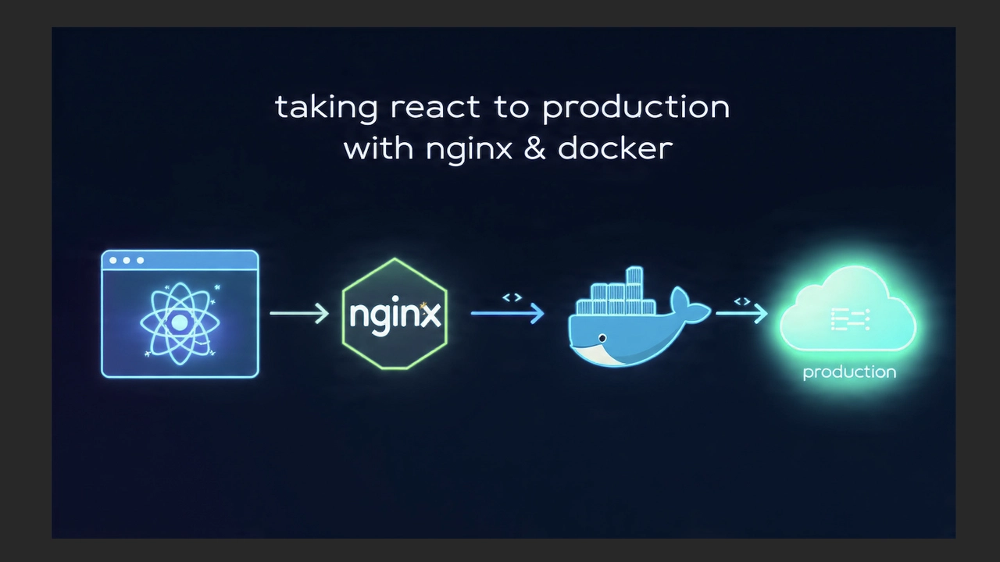

**Figura 3-2. Flujo de construcción de aplicación React y despliegue con Nginx.**

Para esta práctica se utilizará el concepto de **multi-stage builds** en Docker, que permite crear imágenes más pequeñas y eficientes al separar el proceso de construcción del entorno de ejecución. En la primera etapa se compila la aplicación React con Node.js, y en la segunda etapa solo se copia el resultado al servidor Nginx, reduciendo significativamente el tamaño final de la imagen.

El frontend depende de un **backend simulado** desarrollado con JSON Server, una herramienta que permite crear una API REST completa a partir de un simple archivo JSON. Esto facilita el desarrollo y pruebas del frontend sin necesidad de implementar un servidor backend real. JSON Server genera automáticamente endpoints RESTful (GET, POST, PUT, DELETE) basándose en la estructura del archivo JSON proporcionado.

**Repositorios del proyecto:**
- Frontend React: https://github.com/Daviddotcoms/suda-frontend-s6
- Backend simulado (Mock API): https://github.com/Daviddotcoms/mockAPI

La comunicación entre el frontend y el backend se realiza mediante peticiones HTTP asíncronas, típicamente usando Fetch API o Axios. Es esencial comprender conceptos como puertos TCP, protocolos HTTP/HTTPS, CORS (Cross-Origin Resource Sharing), y cómo configurar correctamente las URLs de los endpoints para que el frontend pueda consumir los datos del backend.

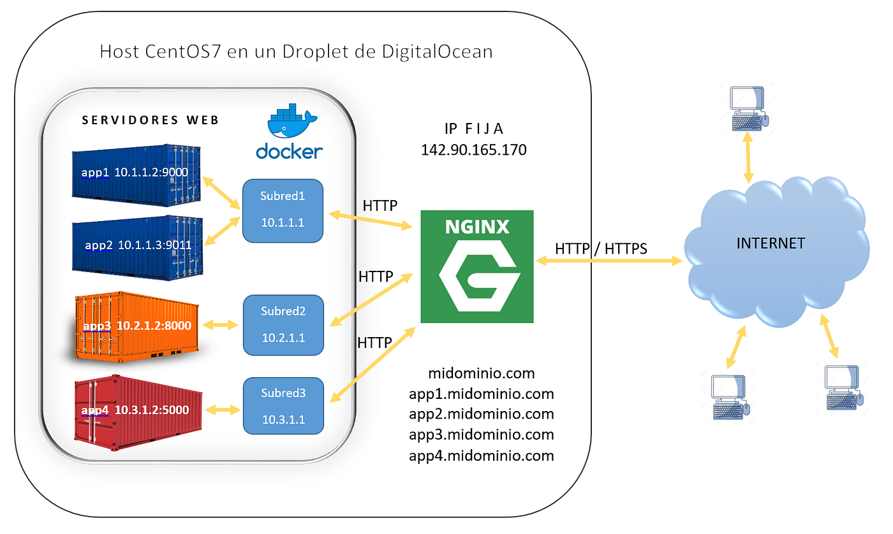

**Figura 3-3. Diagrama de comunicación entre contenedor frontend (Nginx) y backend (JSON Server).**

---

## 4. Conocimientos previos

Para realizar esta práctica el estudiante necesita tener claros los siguientes temas:

- **Comandos básicos de terminal:** Navegación entre directorios, ejecución de comandos, gestión de procesos.
- **Manejo de navegador web:** Acceso a localhost, inspección de elementos, uso de consola de desarrollador.
- **Git y GitHub:** Clonación de repositorios, comandos básicos (`git clone`, `git pull`).
- **Docker básico:** Conceptos de imagen, contenedor, Dockerfile.
- **Comandos Docker fundamentales:**
  - `docker build` - Construcción de imágenes
  - `docker run` - Ejecución de contenedores
  - `docker ps` - Listado de contenedores activos
  - `docker images` - Listado de imágenes disponibles
  - `docker exec` - Ejecución de comandos dentro de contenedores
  - `docker logs` - Visualización de logs de contenedores
- **React básico:** Comprensión de componentes, estructura de proyecto, proceso de build.
- **Nginx:** Conceptos básicos de servidor web estático.

---

## 5. Objetivos a alcanzar

- Implementar un contenedor Docker que ejecute correctamente una aplicación React en producción.
- Crear una imagen Docker personalizada utilizando un Dockerfile con multi-stage builds.
- Manipular archivos de configuración del proyecto para construir la aplicación optimizada.
- Construir y ejecutar contenedores que integren frontend (React + Nginx) y backend simulado (JSON Server).
- Comprender el flujo de construcción de aplicaciones React para entornos de producción.
- Validar el funcionamiento correcto de los servicios desde el navegador web.
- Aplicar buenas prácticas de contenerización para aplicaciones web modernas.
- Documentar el proceso completo de implementación de manera profesional.

---

## 6. Equipo necesario

- **Docker Desktop** v20.10 o superior (Windows/Mac) o **Docker Engine** v20.10+ (Linux)
- **Git** versión 2.30 o superior
- **Node.js** versión 18 o superior con NPM
- **Editor de código** (Visual Studio Code recomendado)
- **Navegador web** moderno (Google Chrome, Microsoft Edge, Mozilla Firefox)

---

## 7. Material de apoyo

- Documentación oficial de Docker: https://docs.docker.com
- Cheat Sheet de Docker: https://docs.docker.com/get-started/docker_cheatsheet.pdf
- Repositorio GitHub del frontend: https://github.com/Daviddotcoms/suda-frontend-s6
- Repositorio GitHub del backend Mock API: https://github.com/Daviddotcoms/mockAPI
- Guía de Dockerfile best practices: https://docs.docker.com/develop/dev-best-practices/
- Tutorial de multi-stage builds: https://docs.docker.com/build/building/multi-stage/  

---

## 8. Procedimiento

### Paso 1: Clonar los repositorios del proyecto

Abrir una terminal y ejecutar los siguientes comandos para clonar tanto el frontend como el backend simulado:

```bash
git clone https://github.com/Daviddotcoms/suda-frontend-s6
git clone https://github.com/Daviddotcoms/mockAPI
```

Estos comandos descargarán ambos proyectos en carpetas separadas en el directorio actual.

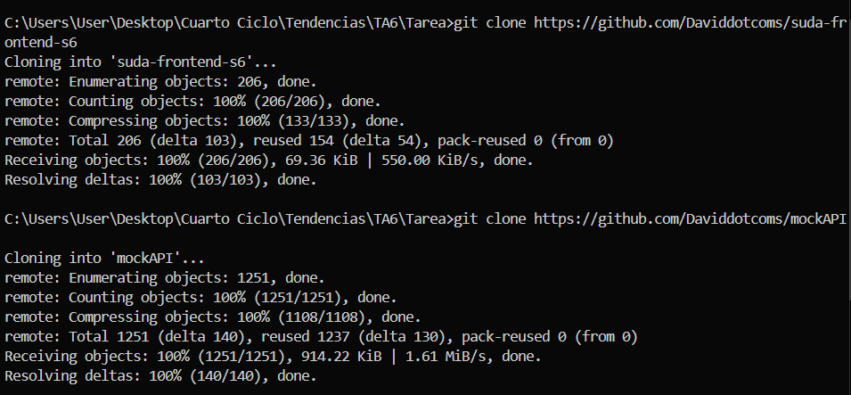

**Figura 8-1. Clonación exitosa de los repositorios frontend y backend.**

---

### Paso 2: Instalar dependencias y ejecutar el frontend localmente

Navegar al directorio del proyecto frontend e instalar las dependencias necesarias:

```bash
cd suda-frontend-s6
npm install
```

Una vez instaladas las dependencias, ejecutar la aplicación en modo desarrollo:

```bash
npm run dev
```

La aplicación React se ejecutará por defecto en http://localhost:5173 o en el puerto disponible que indique la consola.

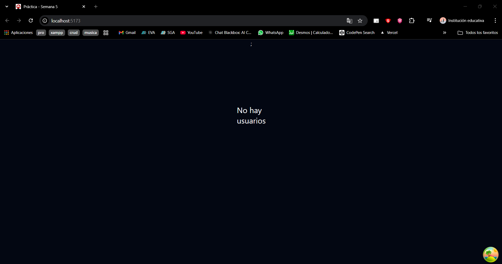

**Figura 8-2. Aplicación React ejecutándose correctamente en modo desarrollo.**

---

### Paso 3: Ejecutar el backend simulado (Mock API)

Abrir una nueva terminal (sin cerrar la anterior) y navegar al directorio del backend:

```bash
cd mockAPI
npm install
```

Iniciar el servidor JSON Server:

```bash
npm run dev
```

El servidor Mock API se ejecutará típicamente en http://localhost:3001 y proporcionará los endpoints REST necesarios para el frontend.

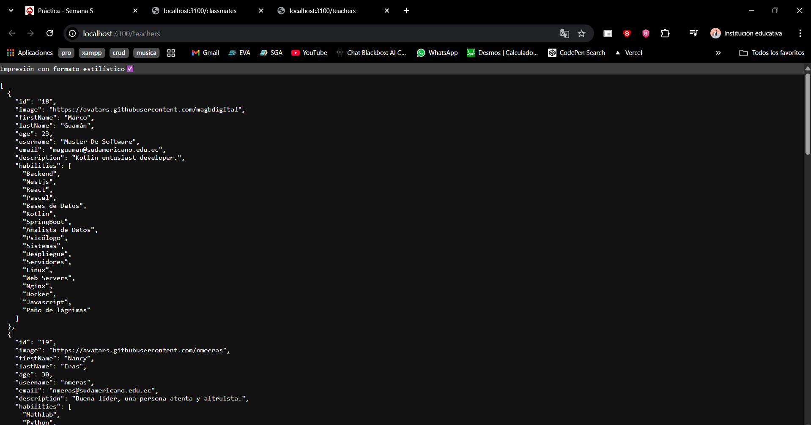

**Figura 8-3. Mock API activa y respondiendo en el puerto 3001.**

---

### Paso 4: Crear el archivo Dockerfile

Dentro del directorio raíz del proyecto frontend (`suda-frontend-s6`), crear un archivo llamado `Dockerfile` (sin extensión) con el siguiente contenido:

```dockerfile
# Etapa 1: Construcción de la aplicación React
FROM node:18 AS build

# Establecer el directorio de trabajo
WORKDIR /app

# Copiar archivos de dependencias
COPY package*.json ./

# Instalar dependencias
RUN npm install

# Copiar el resto del código fuente
COPY . .

# Construir la aplicación para producción
RUN npm run build

# Etapa 2: Servir la aplicación con Nginx
FROM nginx:alpine

# Copiar los archivos construidos desde la etapa anterior
COPY --from=build /app/dist /usr/share/nginx/html

# Exponer el puerto 80
EXPOSE 80

# Comando para iniciar Nginx
CMD ["nginx", "-g", "daemon off;"]
```

Este Dockerfile utiliza multi-stage builds: primero construye la aplicación con Node.js y luego copia solo los archivos estáticos necesarios a una imagen ligera de Nginx.

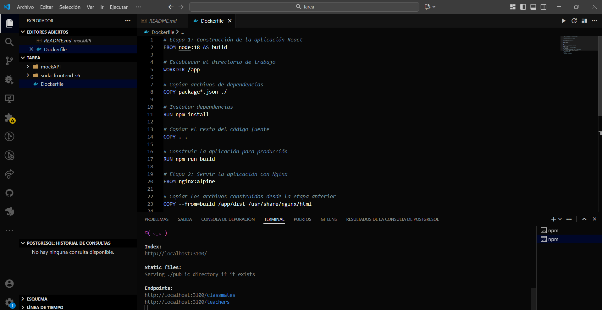

**Figura 8-4. Dockerfile configurado con multi-stage build para optimización.**

---

### Paso 5: Construir la imagen Docker

Desde el directorio del proyecto frontend donde se encuentra el Dockerfile, ejecutar:

```bash
docker build -t frontend-react:latest .
```

Este comando construirá la imagen siguiendo las instrucciones del Dockerfile. El proceso puede tardar varios minutos la primera vez.

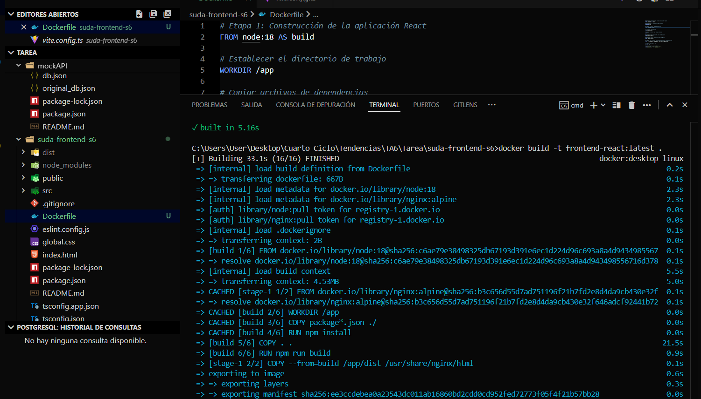

**Figura 8-5. Proceso de construcción de la imagen Docker completado exitosamente.**

Para verificar que la imagen se creó correctamente:

```bash
docker images
```

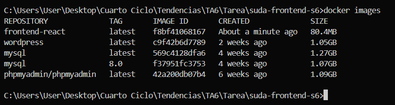

**Figura 8-6. Imagen frontend-react visible en la lista de imágenes Docker.**

---

### Paso 6: Ejecutar el contenedor del frontend

Crear y ejecutar un contenedor a partir de la imagen construida:

```bash
docker run -d -p 8080:80 --name cont-react frontend-react:latest
```

Parámetros utilizados:
- `-d`: Ejecuta el contenedor en modo detached (segundo plano)
- `-p 8080:80`: Mapea el puerto 80 del contenedor al puerto 8080 del host
- `--name cont-react`: Asigna el nombre "cont-react" al contenedor
- `frontend-react:latest`: Especifica la imagen a utilizar

Verificar que el contenedor está en ejecución:

```bash
docker ps
```


**Figura 8-7. Contenedor frontend ejecutándose correctamente, visible con docker ps.**

---

### Paso 7: Verificar el despliegue en el navegador

Abrir un navegador web y acceder a:

```
http://localhost:8080
```

La aplicación React debería cargarse correctamente, servida desde el contenedor Docker con Nginx.

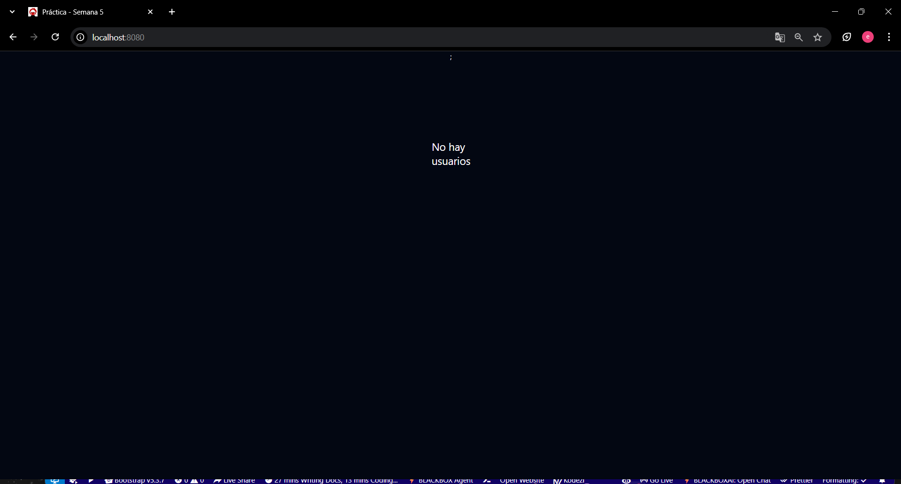

**Figura 8-8. Aplicación React servida exitosamente desde Nginx en contenedor Docker.**

---

### Paso 8: Verificar integración con Mock API

Interactuar con la aplicación para comprobar que se comunica correctamente con el backend simulado. Las peticiones HTTP deberían funcionar sin errores.


**Figura 8-9. Aplicación frontend consumiendo correctamente los datos de la Mock API.**

---

## 9. Resultados esperados

Al finalizar la práctica correctamente, se deben obtener los siguientes resultados:

### 9.1 Imagen Docker personalizada creada

Se habrá generado una imagen Docker optimizada llamada `frontend-react:latest` que contiene la aplicación React compilada y lista para producción, servida por Nginx. La imagen debe aparecer en el listado de imágenes locales de Docker.


**Figura 9-1. Imagen Docker frontend-react visible en el sistema.**

---

### 9.2 Contenedor ejecutándose correctamente

Un contenedor llamado `cont-react` debe estar en estado "running" y accesible a través del puerto 8080 del host. El comando `docker ps` debe mostrar el contenedor activo con su mapeo de puertos correspondiente.

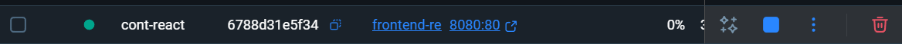

**Figura 9-2. Contenedor frontend-react en ejecución mostrando estado y puertos.**

---

### 9.3 Aplicación React funcionando en navegador

La aplicación debe cargarse correctamente al acceder a http://localhost:8080, mostrando la interfaz de usuario sin errores. Todos los componentes de React deben renderizarse adecuadamente.

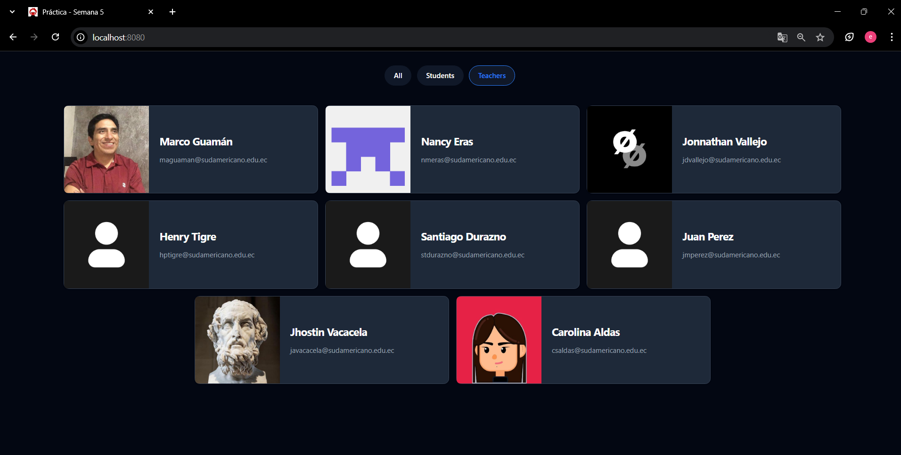

**Figura 9-3. Aplicación React funcionando correctamente en el navegador web.**

---

### 9.4 Integración exitosa con Mock API

El frontend debe comunicarse correctamente con el backend simulado (Mock API) ejecutándose en el puerto 3001. Las peticiones HTTP deben completarse sin errores CORS ni problemas de conectividad, y los datos deben mostrarse en la interfaz.

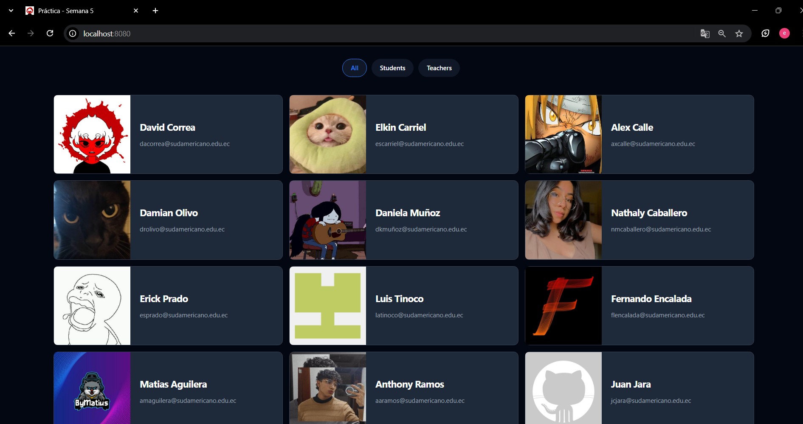

**Figura 9-4. Datos del Mock API mostrándose correctamente en la aplicación.**

---

### 9.5 Logs del contenedor sin errores

Al revisar los logs del contenedor con `docker logs cont-react`, no deben aparecer errores críticos, solo mensajes informativos del servidor Nginx.

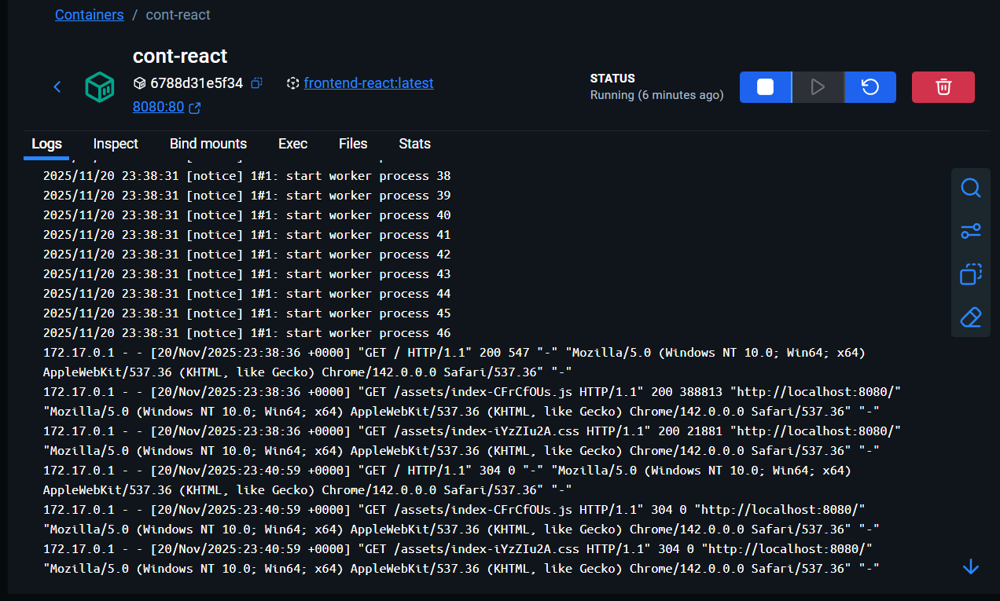

**Figura 9-5. Logs del contenedor mostrando funcionamiento normal de Nginx.**

---


## 10. Bibliografía

Docker Inc. (2024). *Docker Documentation*. Recuperado de https://docs.docker.com

Docker Inc. (2024). *Dockerfile reference*. Recuperado de https://docs.docker.com/engine/reference/builder/

Docker Inc. (2024). *Multi-stage builds*. Recuperado de https://docs.docker.com/build/building/multi-stage/

Meta Platforms, Inc. (2024). *React Documentation*. Recuperado de https://react.dev

Nginx, Inc. (2024). *Nginx Documentation*. Recuperado de https://nginx.org/en/docs/

Daviddotcoms. (2025). *Suda Frontend S6* [Repositorio de código]. GitHub. Recuperado de https://github.com/Daviddotcoms/suda-frontend-s6

Daviddotcoms. (2025). *Mock API* [Repositorio de código]. GitHub. Recuperado de https://github.com/Daviddotcoms/mockAPI

Typicode. (2024). *JSON Server - Get a full fake REST API with zero coding*. GitHub. Recuperado de https://github.com/typicode/json-server
